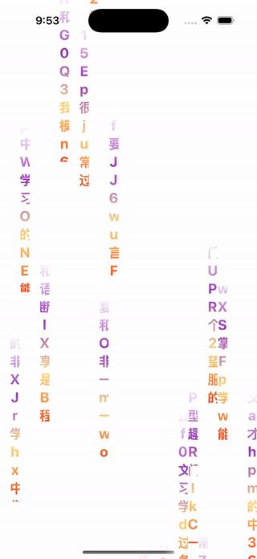
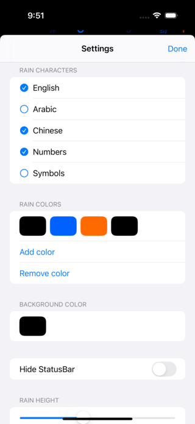

# Rainy Text
<table>
<tr>
<td></td>
<td></td>
<td></td>
</tr>
<tr>
<td></td>
</tr>
</table>

Customizable Matrix rain text animation built with SwiftUI

## Features
* **Fully customizable**: Select what type of characters you want in the rain and what colors your rain gradient should have.
* **Multiplatform**: macOS + iOS

## TODOs
- [X] Make `RainyTextView` a seperate module from the app.
- [X] Ability to adjust height of the rain
- [X] Ability to adjust speed of the rain
